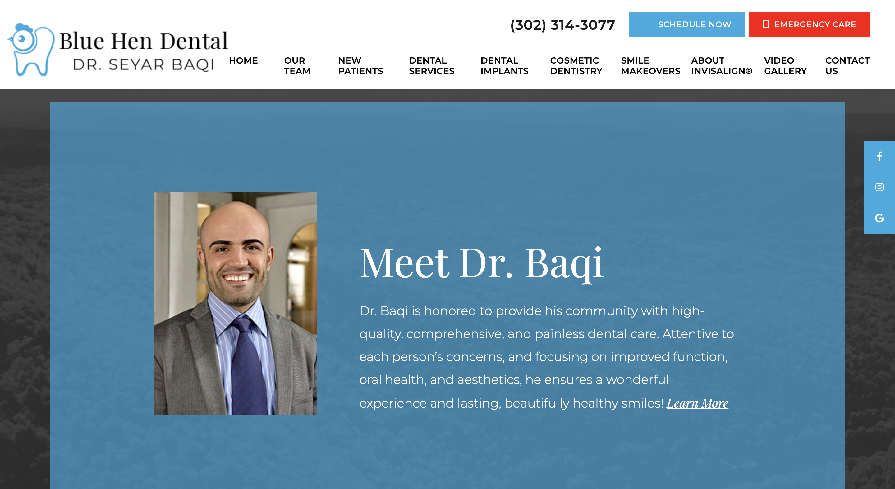
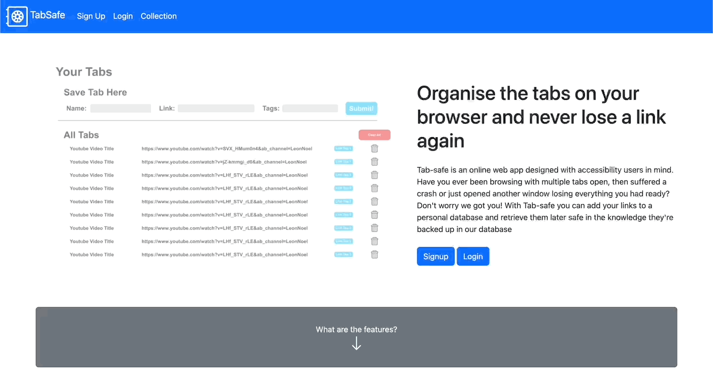
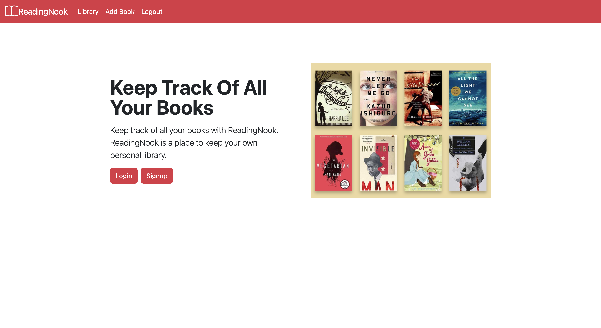
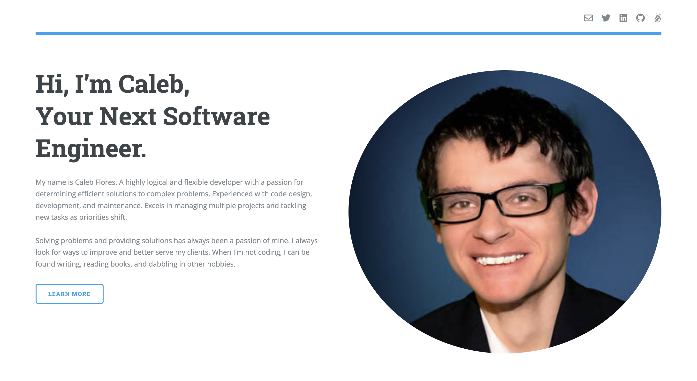

<a href="https://calebflores.netlify.app/" target="_blank">
    

  

<h1 align="center">Projects</h1>
<table bordercolor="#66b2b2">
  <tr>
    <td width="50%" valign="top">
      <h3 align="center">Blue Hen Dental</h3>
         
        
         
        

 
  
      

        
<strong>HTML, CSS, Javascript</strong>  - At Blue Hen Dental, we’re proud to be known for offering the highest quality of dental care in Delaware! Dr. Seyar Baqi and our team make your happiness, comfort, and health our top priorities. We know that visiting the dentist isn’t everyone’s favorite thing to do, so we work hard to provide you with a warm, caring, and friendly environment. 

            </td>
    <td width="50%" valign="top">
      <h3 align="center">TabSafe</h3>
         
        
         
        

          
    
  
      

        
<strong>Javascript, Bootstrap, Node.js, & Express.js</strong> - Tab-safe is an online web app designed with accessibility users in mind. Have you ever been browsing with multiple tabs open, then suffered a crash or just opened another window losing everything you had ready? Don't worry we got you! With Tab-safe you can add your links to a personal database and retrieve them later safe in the knowledge they're backed up in our database.

  <tr>
    <td width="50%" valign="top">
      <h3 align="center">ReadingNook</h3>
         
        
         
        

          
    
  
      

        
<strong>Javascript, Bootstrap, Node.js, & Express.js</strong> - Keep track of all your books with ReadingNook. ReadingNook is a place to keep your own personal library.

    </td>
     <td width="50%" valign="top">
      <h3 align="center">Portfolio</h3>
         
        
         
        

          
    
  
      

        
<strong>HTML5, CSS3, & Javascript</strong> - Portfolio Site including links to my projects and ways to get in contact with me.

    </td>
        </tr>
    
</table>
 
  <!--Analytics & Data-->

<h2 align="center">Technical Skills</h2>

